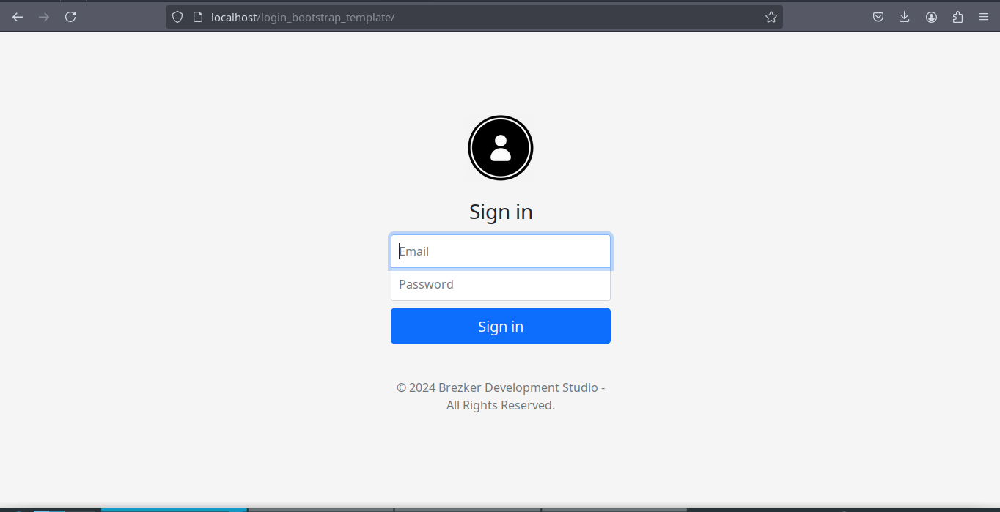

# Login Bootstrap Template
The "Login Bootstrap Template" is a template designed with Bootstrap that offers an elegant and modern design for the login page of a web application. This template uses JavaScript to provide basic password validation functions. With its clean and responsive style, it provides an improved user experience by enabling quick and easy password verification. It is an ideal solution for those looking to implement a professional-looking login form and basic validation functions.

