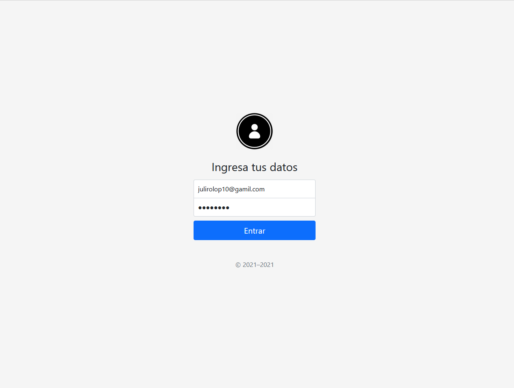

# Login Bootstrap Template
El "Login Bootstrap Template" es una plantilla diseñada con Bootstrap que ofrece un diseño elegante y moderno para la página de inicio de sesión de una aplicación web. Esta plantilla utiliza JavaScript para brindar funciones básicas de validación de contraseñas. Con su estilo limpio y adaptable, proporciona una experiencia de usuario mejorada al permitir la verificación de contraseñas de forma rápida y sencilla. Es una solución ideal para aquellos que buscan implementar un formulario de inicio de sesión con un aspecto profesional y funciones básicas de validación.

